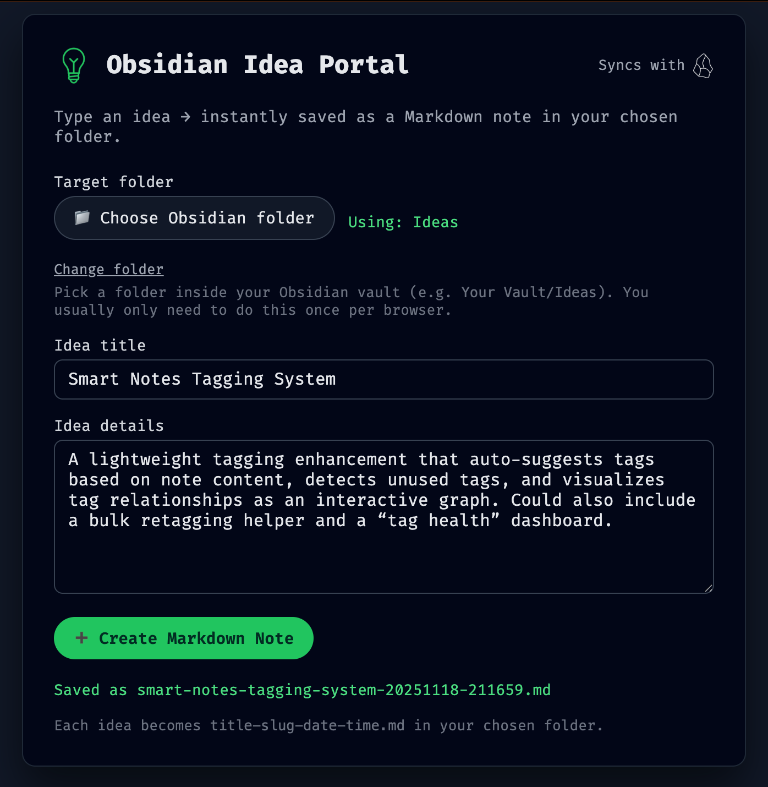
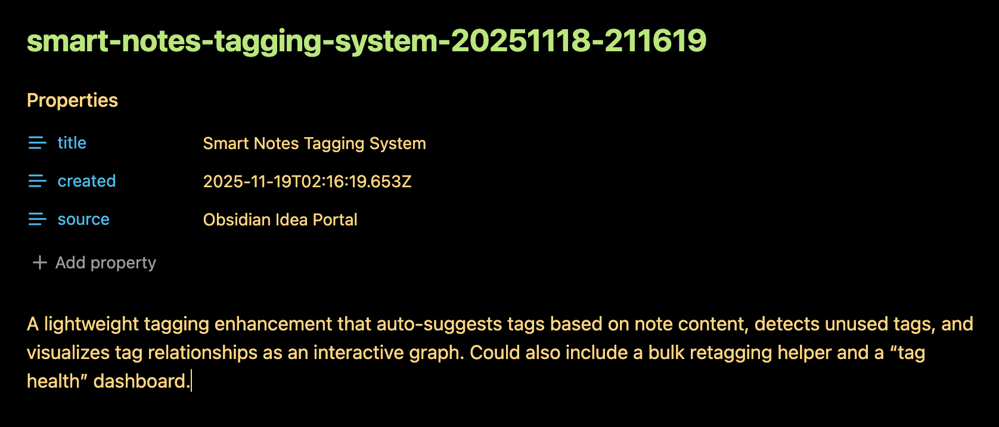

<!-- Begin README -->

<div align="center">
    <a href="https://github.com/scottgriv/Obsidian-Idea-Portal" target="_blank">
        
    </a>
</div>
<br>
<p align="center">
    <a href="https://daringfireball.net/projects/markdown/"></a>
    <a href="https://www.javascript.com/"></a>
    <a href="https://www.w3schools.com/html/"></a>
    <a href="https://www.w3schools.com/css/)"></a>
    <br>
    <a href="https://github.com/scottgriv"></a>
    <a href="mailto:scott.grivner@gmail.com"></a>
    <a href="https://www.buymeacoffee.com/scottgriv"></a>
    <br>
    <a href="https://prgportfolio.com" target="_blank"></a>
</p>

---------------

<h1 align="center">Obsidian Idea Portal</h1>

The **Obsidian Idea Portal** allows you to quickly capture ideas directly into an Obsidian vault folder using the browser, the File System Access API, and a lightweight static HTML page.

<div align="center">
    <a href="https://github.com/scottgriv/Obsidian-Idea-Portal" target="_blank">
        
    </a>
    <br>
    <i>Application Preview</i>
</div>
<br />
<div align="center">
    <a href="https://github.com/scottgriv/Obsidian-Idea-Portal" target="_blank">
        
    </a>
    <br>
    <i>Markdown Output</i>
</div>

---------------

## Table of Contents

- [Getting Started](#getting-started)
  - [Dependencies](#dependencies)
  - [Configuration](#configuration)
  - [Installation](#installation)
  - [Deployment](#deployment)
- [Resources](#resources)
- [License](#license)
- [Credits](#credits)

## Getting Started

This `README` walks you through the setup, folder selection, running the site locally, and deploying it.

## Dependencies

To run the web version locally:

### **Required**

- **Chrome**, **Edge**, or any Chromium-based browser  
  (File System Access API is required)
- **Node.js 16+**
- `npx` (included with Node)

### **Optional**

- Obsidian (to verify notes are appearing in the selected vault folder)

## Configuration

The app requires selecting a vault folder before saving notes.

### **Selecting an Obsidian Vault Folder**

1. Open the web page in your browser.
2. Click **📁 Choose Obsidian folder**.
3. Select a folder inside your vault (example: `Ideas/`).
4. The browser requests permission — click **Allow**.
5. Your folder choice is saved in **IndexedDB**, so it persists across browser sessions.

To change folders later:
- Click **“Change folder”** under the folder selector.

## Installation

### **1. Clone the repository or open the HTML file**

Place the project (this repository) anywhere on your machine, such as:

```
~/Documents/Obsidian-Idea-Portal/
```
### **2. Deploy the app**

See the [Deployment](#deployment) section below.

## Deployment

You need to serve the page over `http://localhost` for the File System Access API to persist directory handles.

### **Run locally with `npx serve`:**

In the root directory, run:

```bash
npx serve .
```

You'll see something like:

```
Serving!
Local: http://localhost:3000
```

Visit:

```
http://localhost:3000/obsidian-idea-portal.html
```

## Resources

- [Obsidian](https://obsidian.md/)
- [Obsidian Community Docs](https://publish.obsidian.md/)
- [Chromium File System Access API](https://nodejs.org/en/)
- [Node.js](https://nodejs.org/)

## License

This project is released under the terms of the **MIT License**, which permits use, modification, and distribution of the code, subject to the conditions outlined in the license.
- The [MIT License](https://choosealicense.com/licenses/mit/) provides certain freedoms while preserving rights of attribution to the original creators.
- For more details, see the [LICENSE](LICENSE) file in this repository. in this repository.

## Credits

**Author:** [Scott Grivner](https://github.com/scottgriv) <br>
**Email:** [scott.grivner@gmail.com](mailto:scott.grivner@gmail.com) <br>
**Website:** [linktr.ee/scottgriv](https://www.linktr.ee/scottgriv) <br>
**Reference:** [Main Branch](https://github.com/scottgriv/Obsidian-Idea-Portal) <br>

---------------

<div align="center">
    <a href="https://www.linktr.ee/scottgriv" target="_blank">
        
    </a>
</div>

<!-- End README -->
